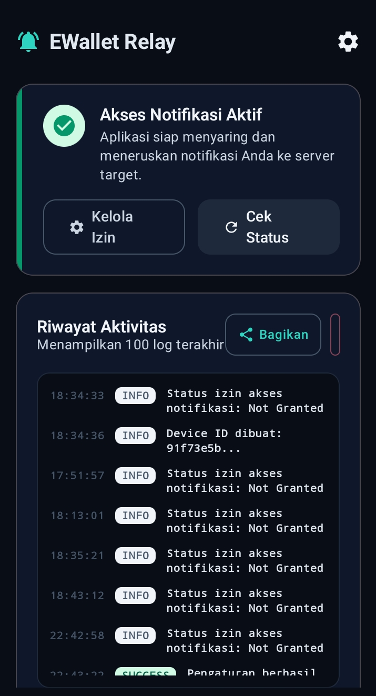
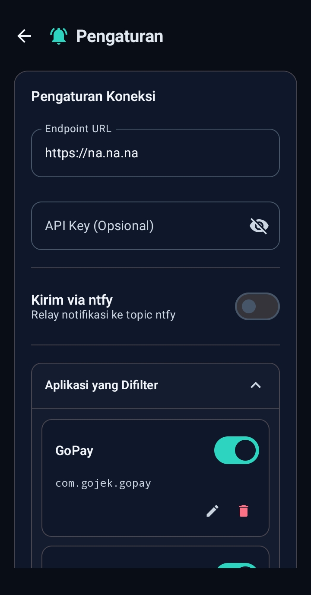

# EWallet Relay

An Android app that captures system notifications and forwards them to a webhook, an [ntfy](https://ntfy.sh) topic, or both. It ships with presets for Indonesian e-wallet apps (GoPay, Dana, ShopeePay, OVO, LinkAja) and detects Rupiah amounts inside the notification text. Offline notifications are queued and retried.


## Screenshots

| Home | Settings |
|------|----------|
|  |  |

## Project Structure

- **`app/`** — Android application (Kotlin + Jetpack Compose)
- **`backend/`** — Node.js Express server for receiving the webhook payload
- **`README.md`** — This file

## Features

- **Notification capture** — reads system notifications through a `NotificationListenerService`.
- **Two delivery targets** — a webhook (HTTP POST, JSON) and an ntfy topic. Enable either or both; each is tried independently.
- **Per-package filtering** — pick which apps to forward, and optionally require a keyword in the notification text before forwarding. Six Indonesian e-wallet apps are preconfigured.
- **Forward-all mode** — a toggle that forwards every app's notifications and ignores the filter list.
- **Rupiah detection** — pulls the Indonesian currency amount out of the text (for example `Rp 100.000` becomes `100000`).
- **Offline queue** — when the network is down or the webhook fails, the notification is stored in a local Room database and retried by WorkManager.
- **Encrypted secrets** — the webhook API key and the ntfy token are stored with Android's `EncryptedSharedPreferences`.
- **Foreground service** — keeps the listener alive.
- **Boot restart** — services come back after a reboot or an app update.
- **Logs** — the 100 most recent events, viewable and exportable in the app.

## Setup

### Android app

**1. Build**

```bash
git clone <repository-url>
cd ewallet-relay
./gradlew assembleDebug
```

**2. Install**

```bash
adb install app/build/outputs/apk/debug/app-debug.apk
```

**3. Grant notification access**

1. Open the app.
2. Follow the prompt to the system's notification-access settings.
3. Find **EWallet Relay** in the list and turn it on.
4. Confirm the system dialog, then return to the app.

**4. Configure a delivery target**

You need at least one of the two. Fill in the webhook, the ntfy section, or both, then tap **Save Settings**. A confirmation dialog appears once the settings are stored.

If prompted, allow the app to ignore battery optimization so the service is not killed in the background.

### Backend (optional webhook receiver)

The `backend/` folder is a reference webhook server. It is not required if you only use ntfy.

1. Install dependencies:
   ```bash
   cd backend
   npm install
   ```
2. Set your API key in `.env`:
   ```env
   API_KEY=your-secret-api-key
   ```
3. Run it:
   ```bash
   npm run dev   # development
   npm start     # production
   ```
4. In the app, set the endpoint URL to `http://your-server:3000/webhook` and the API key to match.

See [`backend/README.md`](backend/README.md) for details, including the Cloudflare Worker variant.

## Settings Reference

### Webhook

| Field | Required | Notes |
|-------|----------|-------|
| Endpoint URL | Yes, unless ntfy is enabled | Must start with `http://` or `https://`. |
| API key | No | Sent as the `X-API-Key` header when set. Stored encrypted. |

### ntfy

ntfy delivery is independent of the webhook — it posts straight to an ntfy server, so the `backend/` receiver is not involved.

| Field | Default | Notes |
|-------|---------|-------|
| Enable ntfy | Off | Turn on to send a plain-text message to a topic. |
| Server URL | `https://ntfy.sh` | Point this at a self-hosted server if you run one. |
| Topic | *(empty)* | Required when ntfy is enabled. |
| Use auth | Off | When on, the token is sent as `Authorization: Bearer <token>` and stored encrypted. |

### Filtering

The app forwards a notification when one of these is true:

- **Forward all apps** is on, or
- the notification's package is in the filter list, that entry is enabled, and either it has no keywords or one of its keywords appears in the title, text, subtext, or big text (case-insensitive).

Each filter entry has a package name, a display name, an optional comma-separated keyword list, and an on/off switch. The app starts with these default entries:

| App | Package |
|-----|---------|
| GoPay | `com.gojek.gopay` |
| GoPay Merchant | `com.gojek.gopaymerchant` |
| Dana | `id.dana` |
| ShopeePay | `com.shopeepay.id` |
| OVO | `ovo.id` |
| LinkAja | `com.telkom.mwallet` |

Keywords narrow a noisy app down to the notifications you care about. For example, adding `masuk, diterima` to a wallet entry forwards incoming-payment notifications and drops the rest. Leave the keyword field empty to forward everything from that app.

The listener always skips its own notifications, ongoing (persistent) notifications, and empty group-summary notifications.

## Webhook Payload

### Notification

```json
{
  "deviceId": "550e8400-e29b-41d4-a716-446655440000",
  "packageName": "id.dana",
  "appName": "DANA",
  "postedAt": "2025-08-30T10:00:24+07:00",
  "title": "DANA",
  "text": "Anda menerima Rp 100.000",
  "subText": "",
  "bigText": "",
  "channelId": "payments",
  "notificationId": 12345,
  "amountDetected": "100000",
  "extras": {
    "android.title": "DANA",
    "android.text": "Anda menerima Rp 100.000"
  }
}
```

`postedAt` is ISO-8601 with the device's timezone offset. `amountDetected` is the digits only, with separators removed, or `null` when no amount is found.

### Test

Tap **Test Connection** to send a small payload to the webhook:

```json
{
  "message": "This is a test notification from the Android app."
}
```

The app treats an HTTP `400` from the test call as a pass, since some receivers reject the minimal test body.

### ntfy message

When ntfy is enabled, each notification is posted as a plain-text body:

```
Aplikasi: DANA
Judul: DANA
Pesan: Anda menerima Rp 100.000
Nominal: 100000
Waktu: 30/08/2025 10:00:24
```

The request sets the `Title`, `Priority` (3), and `Tags` (`ewallet-relay`) headers, plus `Authorization` when auth is enabled.

## cURL Examples

Webhook, no key:

```bash
curl -X POST "https://api.example.com/webhook" \
  -H "Content-Type: application/json" \
  -d '{
    "deviceId": "550e8400-e29b-41d4-a716-446655440000",
    "packageName": "id.dana",
    "appName": "DANA",
    "postedAt": "2025-08-30T10:00:24+07:00",
    "title": "DANA",
    "text": "Anda menerima Rp 100.000",
    "amountDetected": "100000"
  }'
```

Webhook, with key:

```bash
curl -X POST "https://api.example.com/webhook" \
  -H "Content-Type: application/json" \
  -H "X-API-Key: your-secret-api-key" \
  -d '{ "message": "Test notification" }'
```

ntfy, with token:

```bash
curl -X POST "https://ntfy.sh/your-topic" \
  -H "Title: DANA" \
  -H "Priority: 3" \
  -H "Tags: ewallet-relay" \
  -H "Authorization: Bearer your-ntfy-token" \
  -d "Anda menerima Rp 100.000"
```

## Architecture

### Tech Stack

- **Language**: Kotlin
- **UI**: Jetpack Compose + Material 3
- **DI**: Hilt
- **Database**: Room (logs and the retry queue)
- **Network**: Retrofit + OkHttp
- **Background**: WorkManager
- **Storage**: DataStore for settings, EncryptedSharedPreferences for secrets
- **Build**: Gradle Kotlin DSL

### Package Structure

```
com.user_425.ewallet_relay/
├── data/
│   ├── database/      # Room entities, DAOs, database
│   ├── model/         # API and filter models
│   ├── network/       # Retrofit service (webhook + ntfy)
│   ├── preferences/   # DataStore repository
│   ├── repository/    # Delivery, queue, and retry logic
│   └── security/      # Encrypted storage
├── di/                # Hilt modules
├── receiver/          # Boot receiver
├── service/           # Notification listener + foreground service
├── ui/                # Compose screens and components
├── utils/             # Rupiah detection, URL checks, helpers
└── worker/            # WorkManager retry worker
```

## Troubleshooting

**Notifications are not captured**
- Confirm notification access is granted to EWallet Relay.
- If forward-all is off, confirm the app's package is in the filter list and enabled.
- If the entry has keywords, confirm the text actually contains one of them.

**Webhook requests fail**
- Check the endpoint URL and that it is reachable from the phone.
- Check the API key.
- Read the logs for the HTTP status code. Failed sends are queued and retried.

**ntfy messages do not arrive**
- Confirm ntfy is enabled and the topic is set.
- If the server needs auth, confirm the token and that "use auth" is on.

**The service stops in the background**
- Disable battery optimization for the app.
- Confirm notification access was not revoked.

## Development

```bash
./gradlew assembleDebug          # debug build
./gradlew assembleRelease        # release build
./gradlew test                   # unit tests
./gradlew connectedAndroidTest   # instrumentation tests
```

Filtering logic is covered by `app/src/test/java/com/user_425/ewallet_relay/NotificationFilterTest.kt`.

### Requirements

- Android 7.0 (API 24) or newer, target SDK 36
- Kotlin 2.0+
- Jetpack Compose

## License

This project is for demonstration purposes. Capturing notification data can expose personal and financial information — comply with local privacy laws and only forward to endpoints you control.
